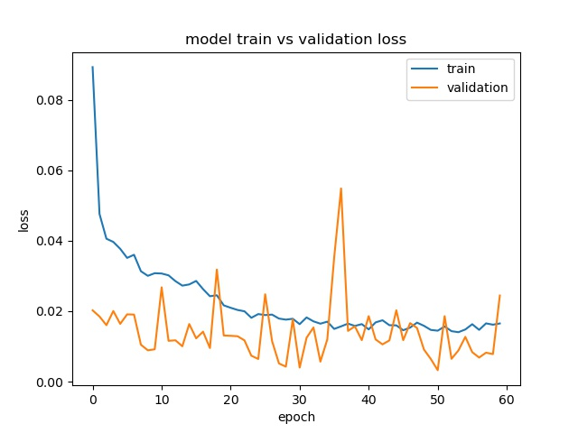
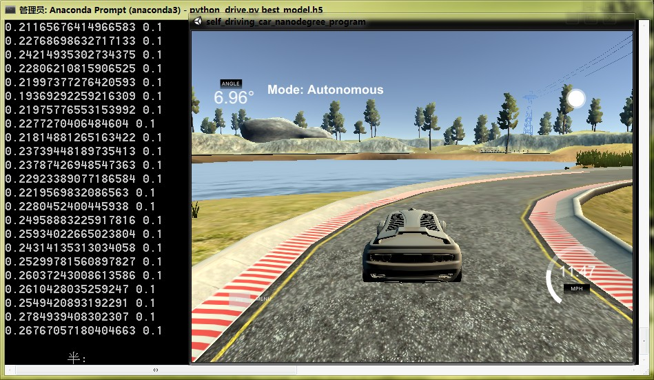

# Self-driving-on-simulator

## Introduction
不是在真实环境中自动驾驶，是基于一个[模拟器](https://github.com/udacity/self-driving-car-sim)

原理是通过一个卷积神经网络，它可以根据车前方图像，预测方向盘转动角度

我也放出了自己的模型，它可以在初级赛道上跑完一圈

## Get started

### Environment & Dependence
我是在 **Windows 7** 下运行这个程序，在 **Linux** 下肯定也能跑，因为模拟器是支持 **Linux** 系统的

我的 python 版本是 **3.7.7**

所有的包都在 **requirement.txt** 里，你可以通过以下命令下载

```shell script
pip install -r requirement.txt
```

### Prepare train dataset
首先根据你的电脑系统下载对应版本的[模拟器](https://github.com/udacity/self-driving-car-sim)

打开软件后，可以看到

两个赛道：简单的和困难的，我的代码和模型都是基于简单赛道的

两种模式：**TRAINING MODE** 和 **AUTONOMOUS MODE**

**TRAINING MODE** 就是收集数据的，你需要先指定一个用于存数据的文件夹，然后通过键盘方向键让小车在路上跑，后台就自动帮你记录车前摄像头的图像，方向盘的转动角度等信息

**AUTONOMOUS MODE** 这是自动驾驶模式，当你训练好一个模型，验证她效果好不好，是否跑着跑着就掉沟里了

顺便说一下，如果你觉得数据量不够或者某些地方要多收集数据，不用改变文件夹，它会自动把新数据添加进去，不会覆盖

收集好数据后你可以通过 **analysis.py** 分析这些数据

## Train

train.py 是用来训练的文件

```shell script
python train.py
```

## Test

drive.py 是用来自动驾驶的文件，通过运行下面命令和运行模拟器，这次选择 **AUTONOMOUS MODE** 就可以看你模型的训练效果了

```shell script
python drive.py path/to/your/model.h5
```

我自己训了一个模型 best_model.h5 他可以绕初级赛道跑一圈，你可以拿来试试看

**loss**



**效果图**

